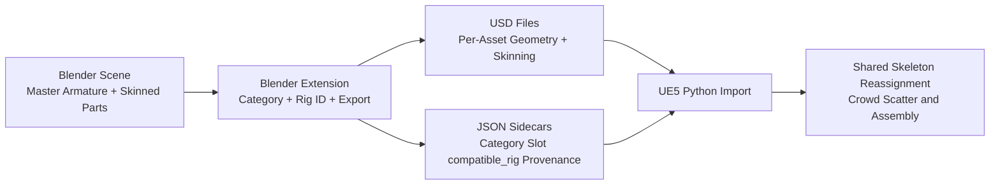

# Blender-UE5 USD Crowd Pipeline

## Project Overview
This project implements a practical crowd-variation pipeline that starts in Blender and targets Unreal Engine 5. The Blender extension exports rigged character bodies, clothing, hair, shoes, and accessories as USD assets plus JSON metadata sidecars, so downstream tools can assemble large visual variety from reusable parts.

The approach is inspired by Sony Pictures Imageworks K-pop Demon Hunters (KPDH)-style previs workflows: a small set of base characters and modular wardrobe pieces produce broad crowd diversity through combinatorics instead of one-off hero builds. Here, that idea is reimplemented with an accessible toolchain (Blender + UE5 + Python) for portfolio and production-adjacent experimentation.

Reference Article: [Reimagining previs and layout for K-pop Demon Hunters with Unreal Engine](https://www.unrealengine.com/spotlights/reimagining-previs-and-layout-for-kpop-demon-hunters-with-unreal-engine)

## Architecture
The pipeline is split into two stages: asset authoring and export in Blender, then import and crowd placement in UE5.



A JSON sidecar is just a small metadata file saved next to each USD file (same asset name, `.json` extension). The USD stores geometry and skinning data, while the JSON stores pipeline metadata such as `category`, `compatible_rig`, and slot/exclusivity rules. The UE scripts need both: USD for the mesh itself, JSON for import routing and crowd-assembly decisions.

For assets to remain interchangeable, body and clothing pieces must share the same rig setup and be exported with the same logical rig ID in metadata. This contract is tracked through the `compatible_rig` field in each sidecar: rig IDs are managed at scene level in a `Rig IDs` list, then assigned per object via dropdown in the export panel. On the UE side, character body imports are processed first and their imported skeletons become the canonical skeletons for their rig IDs unless overridden in `SKELETON_MAP`.

Crowd assembly on the UE side is metadata-driven. It filters by target rig ID, groups imported assets by category, randomly picks from those categories for each character instance, and enforces slot/exclusivity rules so incompatible items are not worn together. It also enforces required coverage policies (for example top/bottom garments), then spawns and links body/garment meshes so they animate as one character. In UE5.5 builds where dynamic component APIs are limited, assembly automatically falls back to a multi-actor SkeletalMeshActor path to preserve compatibility.

## Library Structure
The extension writes one USD and one JSON file per exported asset into category folders:

```text
/library
	/characters/
		body_001.usd
		body_001.json
	/tops/
		jacket_001.usd
		jacket_001.json
	/hair/
	/bottoms/
	/shoes/
	/accessories/
```

JSON sidecars include:

- `category`
- `slot`
- `exclusivity_tags`
- `compatible_rig`
- `source_file`
- `export_date`
- `blender_version`
- `source_asset_name`

## Installation
Install as a Blender 5 extension:

1. Open Blender 5.x.
2. Navigate to Edit -> Preferences -> Add-ons.
3. Select Install from Disk.
4. Point Blender at `src/blender` (or a packaged zip whose root contains `blender_manifest.toml` and `__init__.py`).
5. Enable `Crowd Diversity USD Pipeline`.

## Prerequisites and Required Setup

### Blender Requirements

1. Blender 5.x with this extension enabled.
2. Export assets must be rigged/skinned to a shared logical rig contract, then assigned a `compatible_rig` value in the panel.
3. Maintain the scene-level `Rig IDs` list and assign each selected object a valid rig ID before export.
4. Set/confirm the Blender `Library Output` folder. The default is `~/crowd_diversity_library`.
5. Export creates paired `.usd` + `.json` files; UE import requires both files for each asset.

### UE5 Requirements

Enable these plugins in your UE project before running the importer:

1. `Python Editor Script Plugin` (required)
2. `USD Importer` (required)

Recommended for editor automation workflows:

1. `Editor Scripting Utilities`

Additional UE setup:

1. Ensure your UE project can read the Blender export directory (`LIBRARY_ROOT`).
2. Set/confirm `LIBRARY_ROOT` in `src/ue5/import_garment.py`, or set the `CROWD_DIVERSITY_LIBRARY_ROOT` environment variable before launching UE.
3. Set/confirm `CONTENT_ROOT` in `src/ue5/import_garment.py` (default: `/Game`).
4. Optional: predefine `SKELETON_MAP` entries when you need explicit rig ID -> skeleton overrides.

## Usage
Authoring and export flow:

1. Skin character bodies and modular garments/hair/accessories to the same master armature in Blender.
2. Select one or more rigged mesh assets.
3. In `Rig IDs`, define one or more rig IDs (for example, `mixamo_v1`).
4. In `Selected Asset Types`, assign each selected object both a category and a compatible rig ID.
5. Optionally run Fit Check poses (`Original`, `Neutral`, `A-Pose`, `T-Pose`) for clipping review.
6. Export selected assets to produce USD + JSON sidecars.

UE import flow:

1. Open `src/ue5/import_garment.py` and confirm `LIBRARY_ROOT`, `CONTENT_ROOT`, and optional flags (for example `IMPORT_ONLY_MISSING_USD`).
2. Launch Unreal Editor for your target project.
3. Run the script using one of these methods:
	1. Output Log command: `py "<absolute path to repo>/src/ue5/import_garment.py"`
	2. Tools menu: Tools -> Execute Python Script... and select `src/ue5/import_garment.py`
4. The script automatically discovers USD+JSON pairs, imports character bodies first, registers canonical skeletons by `compatible_rig`, then imports/reconciles non-body assets.
5. Re-running is idempotent when `IMPORT_ONLY_MISSING_USD=True`: already-imported USD folders are skipped.
6. Check the UE Output Log summary for:
	1. `Discovered USDs`
	2. `Newly imported USDs`
	3. `Skipped already-imported USDs`
	4. `Successful assets` and `Failed assets`

## Verification
Core pure-Python export and metadata logic is covered in `tests/test_core.py`, including category path mapping, output path generation, and sidecar serialization behavior.

## Known Limitations
UE5 USD skeletal mesh import generates a skeleton asset per import by default. The included UE5 Python importer handles redirector cleanup, idempotent re-runs, body-first canonical skeleton registration, and canonical skeleton validation.

On UE5.5, skeleton reassignment APIs can be unstable or missing in some builds/projects. The importer prefers editor subsystem reassignment when available and falls back to guarded asset consolidation when necessary.

Blender USD export has practical feature limits for this workflow: bendy bones and non-Armature deformation stacks are not reliably represented for this pipeline target. For predictable interchange, keep export assets on conventional armature-driven skinning.

Objects without a valid rig assignment in the managed rig list are skipped during export and reported as warnings, preventing silent metadata drift.

## Multi-Rig Support (Future Work)
The current implementation intentionally enforces a single-master-rig workflow because it is the most robust baseline for deterministic crowd swaps, and it mirrors common studio practice for large extras populations.

The metadata schema already includes `compatible_rig` specifically to support a future multi-rig pipeline. The current importer already uses rig IDs as its routing key and accepts optional `SKELETON_MAP` overrides (rig ID -> UE5 skeleton path). A fuller multi-rig pipeline would extend that same mechanism into crowd assembly validation and selection logic.
