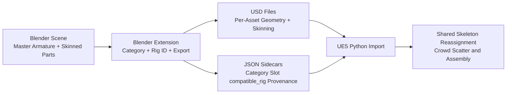

# Blender UE5 USD Crowd Pipeline

## Project Overview
This project implements a practical crowd-variation pipeline that starts in Blender and targets Unreal Engine 5. The Blender extension exports rigged character bodies, clothing, hair, shoes, and accessories as USD assets plus JSON metadata sidecars, so downstream tools can assemble large visual variety from reusable parts.

The approach is inspired by Sony Pictures Imageworks KPDH-style previs workflows: a small set of base characters and modular wardrobe pieces produce broad crowd diversity through combinatorics instead of one-off hero builds. Here, that idea is reimplemented with an accessible toolchain (Blender + UE5 + Python) for portfolio and production-adjacent experimentation.

This repository now includes both halves of the baseline pipeline: Blender authoring/export and a UE5 editor Python importer at `ue5_pipeline/import_garment.py`.

## Architecture
The pipeline is intentionally split into two stages: deterministic asset packaging in Blender, then deterministic assembly in UE5.



Operationally, all exportable parts are expected to be skinned to a single master armature before export. This is a pipeline contract, not a hardcoded rig-name restriction. Any rig can be the master as long as every interchangeable asset references the same logical rig ID in metadata.

That rig contract is tracked through the `compatible_rig` field in each sidecar. Rig IDs are managed at scene level in a `Rig IDs` list, then assigned per object via dropdown in the export panel. This prevents free-text typos while keeping compatibility explicit in metadata.

## Library Structure
The extension writes one USD and one JSON file per exported asset into category folders:

```text
/library
	/characters/
		body_001.usd
		body_001.json
	/tops/
		jacket_001.usd
		jacket_001.json
	/hair/
	/bottoms/
	/shoes/
	/accessories/
```

JSON sidecars include:

- `category`
- `slot`
- `exclusivity_tags`
- `compatible_rig`
- `source_file`
- `export_date`
- `blender_version`
- `source_asset_name`

## Installation
Install as a Blender 5 extension:

1. Open Blender 5.x.
2. Navigate to Edit -> Preferences -> Add-ons.
3. Select Install from Disk.
4. Point Blender at this repository root (or packaged extension zip).
5. Enable `Crowd Diversity USD Pipeline`.

## Usage
Authoring and export flow:

1. Skin character bodies and modular garments/hair/accessories to the same master armature in Blender.
2. Select one or more rigged mesh assets.
3. In `Rig IDs`, define one or more rig IDs (for example, `mixamo_v1`).
4. In `Selected Asset Types`, assign each selected object both a category and a compatible rig ID.
5. Optionally run Fit Check poses (`Original`, `Neutral`, `A-Pose`, `T-Pose`) for clipping review.
6. Export selected assets to produce USD + JSON sidecars.
7. Import in UE5 via `ue5_pipeline/import_garment.py`.

## Known Limitations
UE5 USD skeletal mesh import generates a skeleton asset per import by default. The included UE5 Python importer handles redirector cleanup, idempotent re-runs, and canonical skeleton validation.

On UE5.5, skeleton reassignment APIs can be unstable in some builds/projects. The importer keeps reassignment disabled by default for crash safety (`ENABLE_SKELETON_REASSIGN = False`) and logs duplicate skeleton state for controlled follow-up.

Blender USD export has practical feature limits for this workflow: bendy bones and non-Armature deformation stacks are not reliably represented for this pipeline target. For predictable interchange, keep export assets on conventional armature-driven skinning.

Objects without a valid rig assignment in the managed rig list are skipped during export and reported as warnings, preventing silent metadata drift.

## Multi-Rig Support (Future Work)
The current implementation intentionally enforces a single-master-rig workflow because it is the most robust baseline for deterministic crowd swaps, and it mirrors common studio practice for large extras populations.

The metadata schema already includes `compatible_rig` specifically to support a future multi-rig pipeline. In that phase, the UE5 import layer would maintain a `SKELETON_MAP` (rig ID -> UE5 skeleton path), and crowd assembly logic would validate `compatible_rig` compatibility before pairing garments with character bodies.

That extension is straightforward in principle but was deliberately scoped out of the first implementation to keep the initial system reliable, testable, and portfolio-demonstrable.

## Verification
Core pure-Python export and metadata logic is covered in `tests/test_core.py`, including category path mapping, output path generation, and sidecar serialization behavior.
